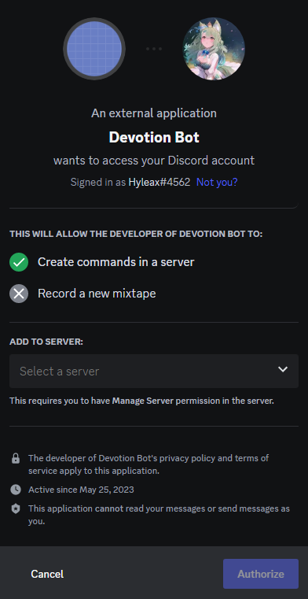

# Discord Daily Devotion (3D or DDD)

## A Bible Devotion Discord Bot
This project is discord bot used for bible devotions. Users can enter in a passage of the bible, and the bot will generate devotion questions for them. 

This bot utilizes the OpenAI API, specically the text-davinci-003 model. This discord is a great tool for Cell Groups, Life Groups to conduct bible study sessions. 

## Features
* Generate questions for a bible passage

## Future Updates will include:
* Devotion progress tracking
* Context and explanations behind passages

## Bot Installation
* click on https://discord.com/oauth2/authorize?client_id=1110932576811634719&scope=applications.commands

* You will be redirected to this page
* choose a server and add the bot to your server

## Bot Usage Instructions
<h3><u>Generating Devotion questions</u></h3>

Enter a section of a bible chapter (e.g. Acts 2: 1- 11)

If you want to enter a only a single verse, enter 0 in the last input

Wait around 3 seconds

The bot will then generate devotion questions based of the entered passage
